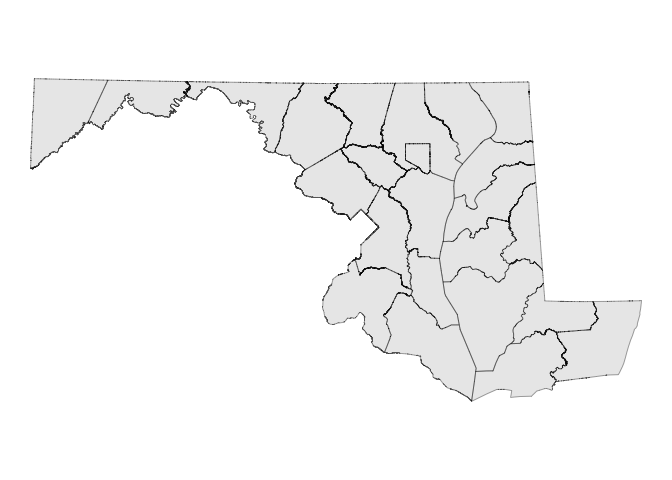
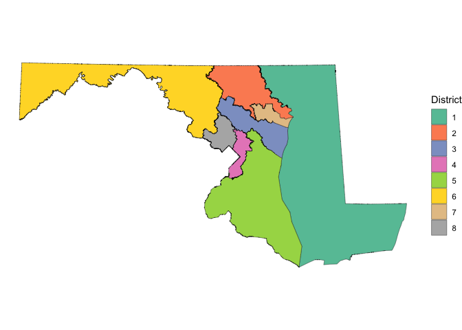
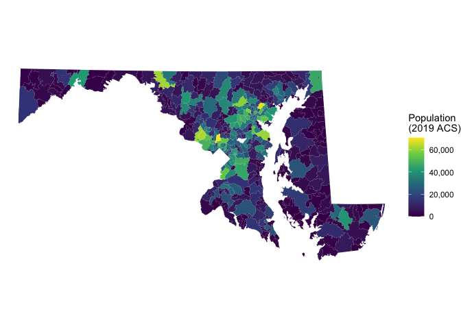

<!-- README.md is generated from README.Rmd. Please edit that file. -->

# mdmaps

<!-- badges: start -->

<!-- badges: end -->

`mdmaps` is an R data package providing pre-projected `sf` objects and
related tibbles for making maps of Maryland. It is modeled on
[`nycmaps`](https://github.com/kjhealy/nycmaps).

All geometries are projected to **EPSG:26985** (NAD83 / Maryland,
meters).

## Installation

``` r
# install.packages("remotes")
remotes::install_github("NewsAppsUMD/mdmaps")
```

## What’s included (v1)

Statewide layers only in v1.

**Administrative boundaries**

- `md_state_sf` — state outline
- `md_counties_sf` — 24 county-equivalents (23 counties + Baltimore
  City)
- `md_counties` — county/FIPS lookup table
- `md_sha_districts_sf` — 7 MDOT State Highway Administration
  engineering districts

**Political districts**

- `md_congressional_districts_sf` — 8 U.S. House districts (119th
  Congress)
- `md_legislative_districts_sf` — 47 state legislative districts (Senate
  1:1)
- `md_delegate_subdistricts_sf` — 71 House of Delegates electing units
  (whole-LD multi-member and A/B/C sub-districts)

**Census geographies**

- `md_census_tracts_{2000,2010,2020}_sf` — decennial census tracts
- `md_census_blocks_2020_sf` — 2020 census blocks (~84k features)
- `md_pumas_{2010,2020}_sf` — Public Use Microdata Areas
- `md_zcta_sf` — ZIP Code Tabulation Areas with 2019 ACS population
- `md_zips` — ZCTA-to-county lookup table

Later releases will add municipalities, school districts, shoreline,
court districts, EMS regions, a dated precinct snapshot, and
per-jurisdiction layers for Baltimore City.

### Notes on specific layers

- **`md_sha_districts_sf` and Baltimore City.** SHA is responsible for
  state-maintained roads in the 23 counties but not inside Baltimore
  City, which runs its own DOT. The `counties` attribute in each
  district row therefore does **not** list Baltimore City, even though
  the polygons themselves cover its land area (District 4 wraps around
  the city). Treat the `counties` field as the SHA maintenance
  footprint, not as a strict geographic county list.

## Examples

``` r
library(mdmaps)
library(ggplot2)
```

### Counties

``` r
ggplot(md_counties_sf) +
  geom_sf() +
  theme_void()
```



### Congressional Districts

``` r
md_congressional_districts_sf
#> Simple feature collection with 8 features and 6 fields
#> Geometry type: MULTIPOLYGON
#> Dimension:     XY
#> Bounding box:  xmin: 185230.5 ymin: 24695.61 xmax: 575762 ymax: 230941.9
#> Projected CRS: NAD83 / Maryland
#>   geoid district_num            district_name congress   land_area water_area
#> 1  2401            1 Congressional District 1      119 10013949639 4256275598
#> 2  2402            2 Congressional District 2      119  2100961804  106733050
#> 3  2403            3 Congressional District 3      119  1296561183  288741049
#> 4  2404            4 Congressional District 4      119   562456426   18570004
#> 5  2405            5 Congressional District 5      119  3928528635 2063211529
#> 6  2406            6 Congressional District 6      119  6203292326   96421134
#> 7  2407            7 Congressional District 7      119   337275331  132139459
#> 8  2408            8 Congressional District 8      119   708198478   17751413
#>                         geometry
#> 1 MULTIPOLYGON (((425830.6 22...
#> 2 MULTIPOLYGON (((373253.9 21...
#> 3 MULTIPOLYGON (((383869.4 18...
#> 4 MULTIPOLYGON (((396537.3 11...
#> 5 MULTIPOLYGON (((371797.8 85...
#> 6 MULTIPOLYGON (((185387.6 18...
#> 7 MULTIPOLYGON (((417678.1 18...
#> 8 MULTIPOLYGON (((370264 1594...
```

``` r
ggplot(md_congressional_districts_sf) +
  geom_sf(aes(fill = factor(district_num))) +
  scale_fill_brewer(palette = "Set2", name = "District") +
  theme_void()
```



### ZIP Code Tabulation Areas

``` r
md_zcta_sf
#> Simple feature collection with 468 features and 3 fields
#> Geometry type: MULTIPOLYGON
#> Dimension:     XY
#> Bounding box:  xmin: 185230.9 ymin: 29251.62 xmax: 570294.2 ymax: 230941.9
#> Projected CRS: NAD83 / Maryland
#> First 10 features:
#>     zcta   zcta_name population                       geometry
#> 1  20601 ZCTA5 20601      25517 MULTIPOLYGON (((400081.9 10...
#> 2  20602 ZCTA5 20602      26550 MULTIPOLYGON (((405443.7 10...
#> 3  20603 ZCTA5 20603      31975 MULTIPOLYGON (((395836.3 10...
#> 4  20606 ZCTA5 20606        374 MULTIPOLYGON (((420655.6 66...
#> 5  20607 ZCTA5 20607      10843 MULTIPOLYGON (((392994.5 11...
#> 6  20608 ZCTA5 20608        860 MULTIPOLYGON (((421644.1 10...
#> 7  20609 ZCTA5 20609       1151 MULTIPOLYGON (((418360.2 64...
#> 8  20611 ZCTA5 20611       1634 MULTIPOLYGON (((398160 8730...
#> 9  20612 ZCTA5 20612        203 MULTIPOLYGON (((427469.9 93...
#> 10 20613 ZCTA5 20613      14020 MULTIPOLYGON (((402888.8 11...
```

``` r
ggplot(md_zcta_sf) +
  geom_sf(aes(fill = population), color = NA) +
  scale_fill_viridis_c(name = "Population\n(2019 ACS)", labels = scales::comma) +
  theme_void()
```



## Building the data

Data objects are rebuilt from source via `data-raw/build_data.R`:

``` r
source("data-raw/build_data.R")
```

Most Tier-1 datasets are pulled from Census TIGER/Line via the
[`tigris`](https://cran.r-project.org/package=tigris) package, so no
shapefiles are checked into this repo.
